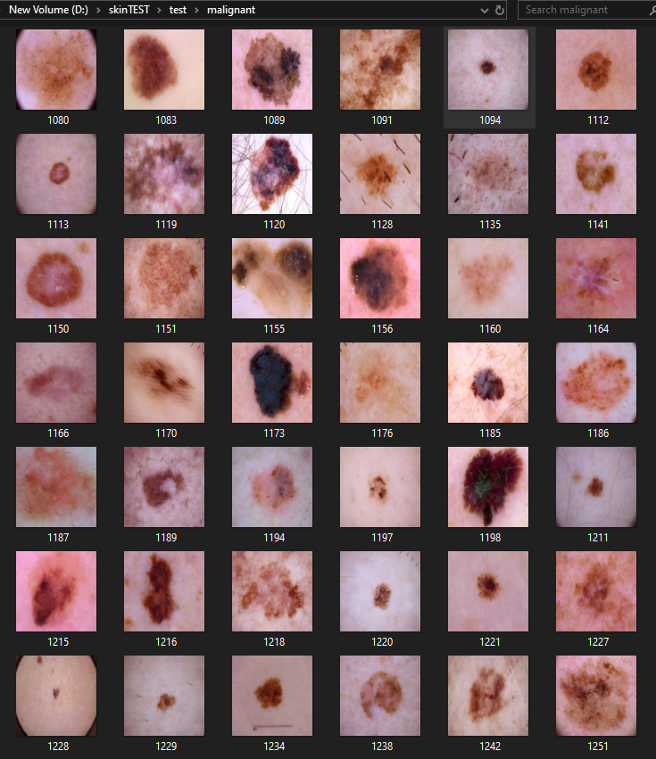
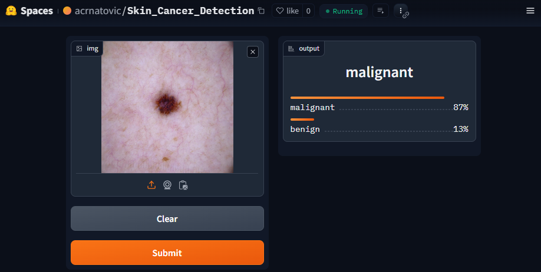

# Skin Cancer Detection Model

This project focuses on developing a deep learning model for skin cancer detection using fastai. The model classifies images of skin moles into two categories: **Benign Moles** (non-cancerous) and **Malignant Moles** (potentially cancerous, requiring medical attention). The model is trained on a labeled dataset and can assist in early detection of skin cancer.

## Table of Contents
- [Model Overview](#model-overview)
- [Datasets](#datasets)
- [Model Architecture and Training](#model-architecture-and-training)
- [Prediction Examples](#prediction-examples)
- [Screenshots](#screenshots)

## Model Overview

The **Skin Cancer Detection Model** utilizes **ResNet18** architecture, implemented in fastai, for image classification. It is fine-tuned on a dataset of skin mole images to distinguish between benign and malignant moles.

## Datasets

The dataset consists of images from Kaggle, categorized into:
- **Benign Moles**: Non-cancerous moles.
- **Malignant Moles**: Cancerous moles, specifically melanoma.

Images are organized in the following folders:
- `benign`
- `malignant`

## Model Architecture and Training

### Data Preprocessing
- **Renaming Images**: Images are renamed based on their labels (e.g., `benign_1.jpg`, `malignant_1.jpg`).
- **Augmentation**: Random resized crop and transformations are applied to improve model generalization.

### Model Training
- **Architecture**: The model uses **ResNet18**, fine-tuned for 4 epochs using fastai’s `fine_tune()` method.
- **Metrics**: Error rate and confusion matrix are used to evaluate performance.

## Prediction Examples

### Benign Moles:

1. **Example 1**: Image from the test folder showing a benign moles.
   

2. **Example 2**: Prediction made by the model on the benign mole.
   
   - **Prediction**: Benign Mole (100%)

### Malignant Moles:

1. **Example 1**: Image from the test folder showing a malignant mole.
   

2. **Example 2**: Prediction made by the model on the malignant mole.
   
   - **Prediction**: Malignant Mole (87%)

