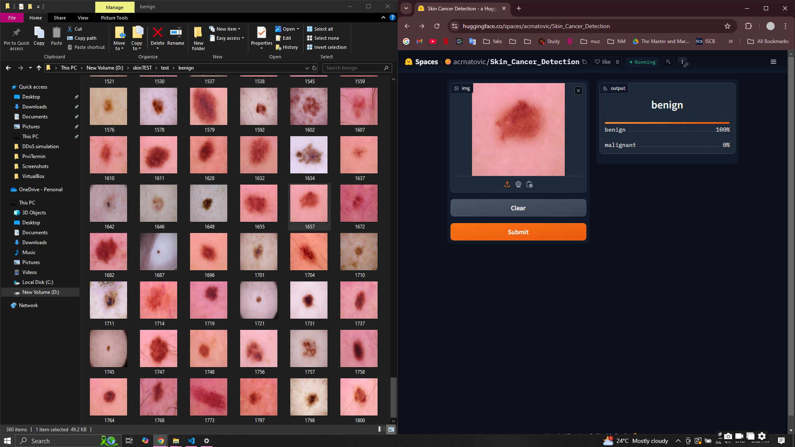
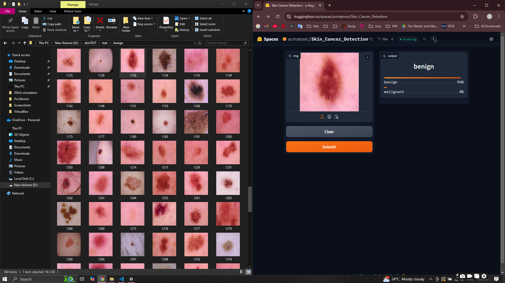
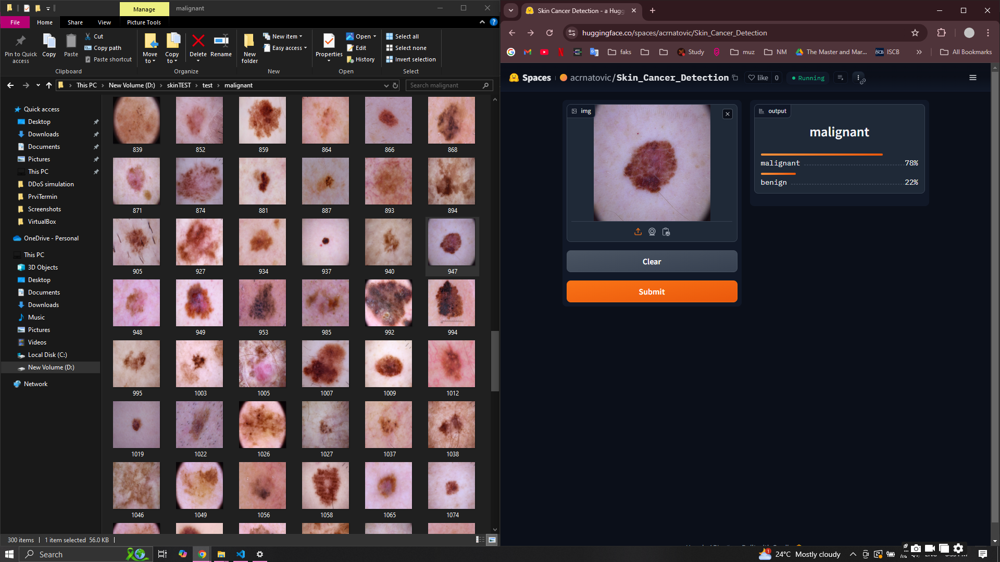
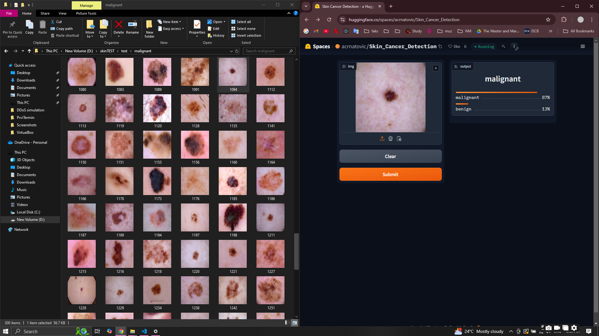

# Skin Cancer Detection Model

## Model Overview

The skin cancer detection model utilizes deep learning techniques to analyze images of skin moles. It classifies moles into two categories:
- **Benign Moles**: Non-cancerous growths that do not pose any threat.
- **Malignant Moles**: Cancerous growths, specifically melanoma, which require medical attention.

## Datasets

The model is trained on a dataset consisting of images of skin moles, where each mole is labeled as either benign or malignant. This dataset enables the model to learn the distinguishing features of different types of moles and make accurate predictions.

## Prediction Examples

### Benign Moles

The following images show examples of benign moles predicted by the model:

1. 
   - *This image displays a benign mole, confirmed by the model's prediction.*
   
2. 
   - *Another example of a benign mole, with the model indicating it is non-cancerous.*

### Malignant Moles

The following images show examples of malignant moles predicted by the model:

1. 
   - *This image displays a malignant mole, which the model identified as potentially cancerous (melanoma).*
   
2. 
   - *Another example of a malignant mole, confirmed by the model's prediction as requiring further medical evaluation.*

## Conclusion

This skin cancer detection model demonstrates the potential of deep learning in medical image analysis, particularly in the early detection of skin cancer. Accurate predictions of benign and malignant moles can assist healthcare professionals in making informed decisions about patient care.
